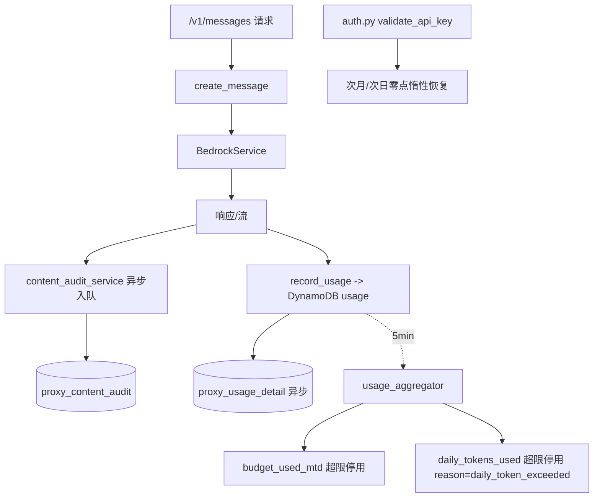

# 限额功能完善与 MySQL 内容审计增强

## 调研结论（任务 1/2/9/13 的分析答复）

- **任务 1 存储与入口**：API key 及其限额配置存于 DynamoDB `anthropic-proxy-api-keys`（字段含 `monthly_budget`/`budget_used_mtd`/`rate_limit`/`service_tier`/`is_active`/`deactivated_reason` 等），管理后台 `app/db/dynamodb.py` 的 `APIKeyManager` 读写。配置入口在 [admin_portal/frontend/src/pages/ApiKeys.tsx](admin_portal/frontend/src/pages/ApiKeys.tsx) 的 `ApiKeyForm`（Edit 模式）。用量明细写入 `anthropic-proxy-usage`，聚合到 `anthropic-proxy-usage-stats`，金额累加到 key 的 `budget_used_mtd`。
- **任务 2 限额中间件逻辑**：月度预算**不在中间件预检**，而是后台聚合器（每 5 分钟，[admin_portal/backend/services/usage_aggregator.py](admin_portal/backend/services/usage_aggregator.py)）累加 `budget_used_mtd`，超限时 `deactivate_for_budget_exceeded()` 将 `is_active=False`；下次请求在 [app/middleware/auth.py](app/middleware/auth.py) → `validate_api_key()` 返回 None → 401。跨月在 `validate_api_key` 惰性恢复。速率限制是独立的进程内 Token Bucket（[app/middleware/rate_limit.py](app/middleware/rate_limit.py)），**保持不变**。
- **任务 9 OTEL_TRACE_CONTENT 确认**：属实。`otel_trace_content` 默认 `False`（[app/core/config.py](app/core/config.py):211），仅当为 `true` 时把 prompt/completion 写入 span attribute/event（`app/tracing/spans.py`、`streaming.py`、`app/api/messages.py`）。它**只影响可观测性输出**。任务 10 的内容审计将**完全独立**于该开关，永远记录。
- **任务 13 日志/CloudWatch 确认**：应用层只写 `sys.stdout`（[app/core/logging.py](app/core/logging.py) `setup_logging`），CloudWatch 由 CDK 的 ECS `awsLogs` driver 采集（`cdk/lib/ecs-stack.ts`），**应用代码不直接调用 CloudWatch**。当前**不支持**本地文件 → 需新增配置项。

## 默认假设（因问题被跳过，采用推荐方案，可在确认时修改）

- MySQL 写入：**异步后台写**（请求结束后入队/后台线程写，不阻塞响应）；保留 DynamoDB usage 写入用于预算聚合，MySQL 作为明细+审计的持久层。
- 时区：新增全局 `APP_TIMEZONE`（默认 `Asia/Shanghai`），统计/审计页面提供时区下拉临时切换显示；**日限额"每日零点"按 `APP_TIMEZONE` 判定**；DB 一律存 UTC。
- MySQL 部署：应用层集成 + `docker-compose` 增加本地 MySQL + 新增连接配置项；**CDK/RDS 暂不改**（如需再加）。
- 日限额停用：**走与月度预算相同的异步聚合机制**（最多约 5 分钟延迟），次日零点惰性恢复。
- 内容审计字段：采用我提议的字段集。

---

## 阶段 A：基础设施（MySQL + 时区 + 配置 + 日志文件）

- **依赖**：`pyproject.toml` 增加 `SQLAlchemy>=2.0` + `PyMySQL`（同步驱动，契合项目"同步 boto3"风格）。
- **配置** [app/core/config.py](app/core/config.py)：新增 `app_timezone`(默认 `Asia/Shanghai`)、`mysql_enabled`、`mysql_host/port/user/password/database`（或 `mysql_dsn`）、`content_audit_enabled`(默认 True)、`log_to_file`(默认 False)、`log_file_path`、`log_file_rotation`(大小/份数)。
- **时区工具** 新增 `app/core/timezone.py`：`now_utc()`、`to_tz(dt, tz)`、`day_bounds_utc(date, tz)`（给定本地日期返回 UTC 起止）、`current_local_date(tz)`。
- **MySQL 层** 新增 `app/db/mysql/`：`engine.py`(SQLAlchemy engine + session)、`models.py`(ORM 表)、`base.py`、各 repository。表名前缀复用配置（如 `anthropic-proxy-` 对应 MySQL 用 `proxy_` 前缀）。
- **建表脚本** 新增 `scripts/setup_mysql.py`（建表/迁移），并在 [docker-compose.yml](docker-compose.yml) 增加 `mysql` 服务。
- **日志文件** 改 [app/core/logging.py](app/core/logging.py) `setup_logging()`：当 `log_to_file=True` 时额外/改用 `RotatingFileHandler(log_file_path)`，保留现有 `StructuredFormatter`；stdout 仍可并存。更新 `env.example`、`docs/configuration.md`。

## 阶段 B：MySQL 数据模型（任务 5/6/10/12）

MySQL 表（全部时间列存 UTC `DATETIME`）：
- `proxy_api_keys`：API key 全字段主存储（任务 6 的"先写 MySQL 再同步 DynamoDB"的源），含新增的日限额字段。
- `proxy_usage_detail`：逐请求 token 明细（任务 5）。字段：request_id、api_key、user_id、model、resolved_model、api_surface、service_tier、input/output/cache_read/cache_write/reasoning/total tokens、cost、success、request_time(UTC)、created_at。
- `proxy_content_audit`：内容审计（任务 10），字段集见下。
- `proxy_content_audit_archive_history`：归档历史（任务 12），字段：archive_time、archive_table_name、record_count、data_start_time、data_end_time、duration_ms、status(running/done/failed)、保留天数 N、截止日期。
- 归档表 `proxy_content_audit_YYYYMMDDHHMM`：归档时动态建表（结构同 `proxy_content_audit`）。

**内容审计表字段**（提议）：`id`、`request_id`、`api_key`、`user_id`、`owner_name`、`request_time(UTC)`、`model`、`resolved_model`、`api_surface`、`service_tier`、`system_prompt`、`request_messages(JSON/LONGTEXT)`、`tools(JSON)`、`response_content(LONGTEXT)`、`stop_reason`、`streaming(bool)`、`input_tokens`、`output_tokens`、`cache_read_tokens`、`cache_write_tokens`、`reasoning_tokens`、`total_tokens`、`cost`、`duration_ms`、`success`、`error_message`、`client_ip`、`created_at`。

## 阶段 C：API key 主存储迁移 + 同步（任务 6）

- 改 [admin_portal/backend/api/api_keys.py](admin_portal/backend/api/api_keys.py) 的 create/update/deactivate/reactivate/delete：**先写 MySQL `proxy_api_keys`，成功后再同步写 DynamoDB**（复用 `APIKeyManager`）。封装在新的 `admin_portal/backend/services/api_key_store.py`（MySQL repo + DynamoDB sync）。
- 列表读取优先 MySQL（保证一致），用量统计仍来自 DynamoDB stats/MySQL 明细。
- **一键同步**：新增 `POST /api/keys/sync-to-dynamo`，遍历 MySQL 全部 key 覆盖写入 DynamoDB（系统初始化/覆盖用）。前端 ApiKeys 页加"同步至 DynamoDB"按钮。

## 阶段 D：日 token 限额（任务 3/4/7）

- **DynamoDB + MySQL key 字段新增**：`daily_token_limit`(单位"万"，0=不限)、`daily_tokens_used`(原始 token 数)、`daily_tokens_date`(`YYYY-MM-DD`，按 `APP_TIMEZONE`)。`deactivated_reason` 增加取值 `"daily_token_exceeded"`。改 `APIKeyManager.create_api_key/update_api_key`（[app/db/dynamodb.py](app/db/dynamodb.py)）支持这些字段。
- **聚合累加**：在 `UsageStatsManager.aggregate_all_usage`/`increment_budget_used` 旁新增日 token 累加逻辑（`increment_daily_tokens`）：按 `APP_TIMEZONE` 当日累加，跨日重置；`daily_tokens_used >= daily_token_limit*10000` 时调用停用（reason=`daily_token_exceeded`）。速率限制不变。
- **次日零点恢复**：改 `validate_api_key`（[app/db/dynamodb.py](app/db/dynamodb.py)），仿 `_reactivate_for_new_month` 增加 `_reactivate_for_new_day`：若 `deactivated_reason=="daily_token_exceeded"` 且 `daily_tokens_date != 今日(APP_TIMEZONE)`，重置并 `is_active=True`。
- **Edit 入口**：[admin_portal/frontend/src/pages/ApiKeys.tsx](admin_portal/frontend/src/pages/ApiKeys.tsx) 表单加"日 Token 限额(万)"输入；schema [admin_portal/backend/schemas/api_key.py](admin_portal/backend/schemas/api_key.py)、类型 [admin_portal/frontend/src/types/api-key.ts](admin_portal/frontend/src/types/api-key.ts) 增加字段。
- **列表新增列**（任务 7）：在 ApiKeys 列表加"日 Token 限额"列，显示 `daily_tokens_used/限额` 及百分比进度条（效果同 Monthly Budget 列），万为单位展示。

## 阶段 E：内容审计运行时记录（任务 10，独立于 OTEL_TRACE_CONTENT）

- 新增 `app/services/content_audit_service.py`：异步队列 + 后台 worker 写 `proxy_content_audit`（`content_audit_enabled` 控制；失败不影响主请求）。
- 接入点 [app/api/messages.py](app/api/messages.py) `create_message`：非流式在拿到 response 后入队；流式用类似 `StreamingSpanAccumulator` 的累加器在流结束 finalize 时入队（含 request_messages/system/tools 与累计 response 文本、token、stop_reason、duration）。
- OpenAI passthrough（`app/api/openai_passthrough/router.py`）同样接入。
- 关键：**无论 `otel_trace_content` 取值都记录**，与 OTEL 完全解耦。

## 阶段 F：管理后台后端 API（任务 8/11/12）

- **用量统计**（任务 8）`admin_portal/backend/api/usage_stats.py`：`GET /api/usage-stats?start&end&tz&group=range|day`，按时间区间(精确到分)逐用户输出。**区分两类字段**：
  - 汇总值（在选定时间区间内对 `proxy_usage_detail` 做聚合求和）：`input`、`output`、`cache read`、`cache write`、`total token usage`、`requests`、`total cost`。按 UTC 范围查询、按 `tz` 归并。
  - 用户/key 配置属性（**非汇总**，直接取该用户当前 API key 配置，不随时间区间变化）：`owner`、`daily limit`(日 token 限额，万)、`monthly budget`、`service tier`。来自 `proxy_api_keys`/DynamoDB key 配置。
  - 实现：先对明细做 `GROUP BY api_key` 求和得到汇总指标，再 join/合并 key 配置补齐属性字段；某用户在区间内无用量时仍可按需展示其配置属性（汇总值为 0）。
- **内容审计查询/导出**（任务 11）`admin_portal/backend/api/content_audit.py`：分页 `list`(按 user/时间)、`detail`(全文)、`export`(生成 markdown，仿 Agent 会话导出)。
- **审计历史/归档**（任务 12）`admin_portal/backend/api/content_audit_history.py`：
  - `GET /info`：审计表总量、最早日期、距今天数。
  - `POST /archive`（body: `keep_days N`）：**异步任务**（后台线程，仿 `usage_aggregator` 的 task 模式），建 `proxy_content_audit_YYYYMMDDHHMM` 表、迁移截止日期(今日-N，按 APP_TIMEZONE)之前数据、写归档历史；返回 `task_id`，`GET /archive/status/{task_id}` 跟踪状态。
  - `GET /history?start&end`：按"归档数据起始<=查询结束 AND 归档数据结束>=查询开始"过滤，按归档时间倒序。
  - `GET /archive/{table}/...`：对指定归档表做与内容审计页一致的查询/详情/导出。
- 全部在 [admin_portal/backend/main.py](admin_portal/backend/main.py) `include_router` 注册。

## 阶段 G：管理后台前端（任务 7/8/11/12）

- 前端依赖：`package.json` 增加 `react-markdown`(+ `remark-gfm`) 用于全文 markdown 渲染。
- **新页面**（按现有 types→api.ts→hooks→page 模式 + i18n zh/en + Sidebar 菜单 + App 路由）：
  - `UsageStats.tsx`（任务 8）：时间区间(到分)选择 + "按天统计"模式（含"前一天/后一天"切换）+ 时区下拉；表格列同任务要求。
  - `ContentAudit.tsx`（任务 11）：分页列表(按用户/时间查询) + 行展开全文(markdown) + 导出 markdown。
  - `ContentAuditHistory.tsx`（任务 12）：信息展示 + "归档 N 天前"按钮(输入校验 N>0 + 异步任务进度) + 归档历史列表(时间区间查询) + 表名点击进入该归档表查询/展示/导出。
- ApiKeys 页：加日限额列(任务 7) + Edit 表单日限额输入 + 一键同步按钮。
- 复用 [admin_portal/frontend/src/pages/ApiKeys.tsx](admin_portal/frontend/src/pages/ApiKeys.tsx) 的 Blob 下载模式实现 markdown 导出。

## 阶段 H：文档与校验

- 更新 `CLAUDE.md`/`docs/configuration.md`/`env.example`：新增配置项、MySQL 表、新页面、日限额、本地日志说明。
- `ReadLints` 校验改动文件；本地 `docker-compose up mysql` + `scripts/setup_mysql.py` 验证建表。

## 数据流（新增部分）

